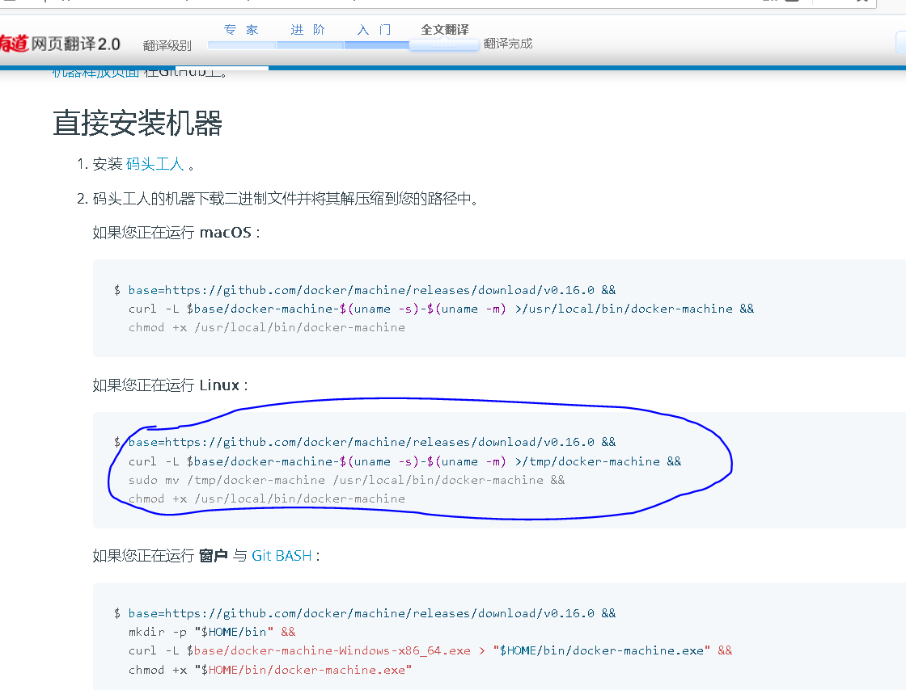
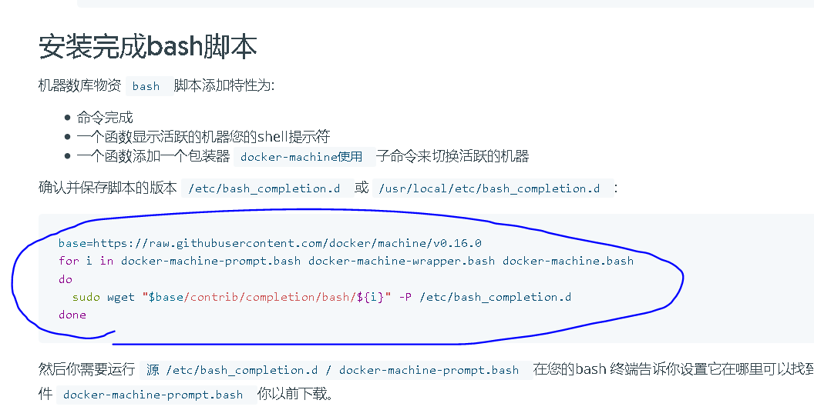
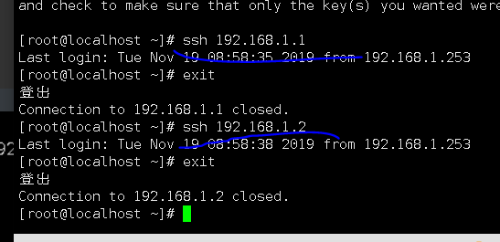

## Docker-Machine多主机管理

作用：集中化管理部署docker

####  之前我们都是在一台主机上部署docker服务，然后在主机上部署了N个docker容器，现在我们要在不同的主机上部署docker服务，实现docker群集。 但是不同主机的docker服务并不统一。


那么怎么去管理这些docker服务主机那？ 就用到我们的machine了

## 实验环境：


192.168.1.20 （已安装的docker服务）（未安装Machine）


192.168.1.21   未安装docker

192.168.1.22   未安装docker


# 1  docker-Machine安装（host1）

作用：在一台主机上集中化管理所有的主机

进入官方

```
https://docs.docker.com/machine/install-machine/
```



先下载

```
base=https://github.com/docker/machine/releases/download/v0.16.0 &&
  curl -L $base/docker-machine-$(uname -s)-$(uname -m) >/tmp/docker-machine &&
  sudo mv /tmp/docker-machine /usr/local/bin/docker-machine &&
  chmod +x /usr/local/bin/docker-machine
```


然后电脑当中会多出一条（docker-machine）的命令


查看版本号

```
docker-machine version
```

输出

```
docker-machine version 0.16.0, build 702c267f        //16版本是目前最新的版本
```


然后还要下载一个东西，不过是要用shell去下载，先回到网页


复制这个路径

```
/etc/bash_completion.d/docker-machine-prompt.bash
```

编辑文件

vim  /etc/bash_completion.d/docker-machine-prompt.bash        //这个文件名称并不是固定的，可以自定义

添加：（复制页面上的脚本信息）



```
base=https://raw.githubusercontent.com/docker/machine/v0.16.0
for i in docker-machine-prompt.bash docker-machine-wrapper.bash docker-machine.bash
do
  sudo wget "$base/contrib/completion/bash/${i}" -P /etc/bash_completion.d
done
```

复制进入，然后读这个文件

```
source /etc/bash_completion.d/docker-machine-prompt.bash
```

他会自动下载3个文件

#切换到/etc/bash_completion.d/目录下

```
#之前的脚本就不用了（删除）
rm -rf /etc/bash_completion.d/docker-machine-prompt.bash
```


只要显示有这3个就行了，如果前边改过了名字，bash就不会有.1的后缀了

为了方便查看我们改下名

```
 mv /etc/bash_completion.d/docker-machine-prompt.bash.1 /etc/bash_completion.d/docker-machine-prompt.bash
```


这3个东西是为了使我们区分我们正在操作的是那台docker主机


切换到家目录

```
cd
```

编辑.bashrc文件

vim .bashrc

添加：

```
PS1='[\u@\h \W$(__docker_machine_ps1)]\$ '
```

因为machine还没有装完，所以现在不要读这个文件


## 2   我们需要创建主机

查看群集

```
docker-machine ls
```


现在是为空的，什么都没有


远程管理的原理：

​      通过本机中的ssh，登陆到客户机上，然后再管理


# 2.1部署前置条件


## 2.1.1.  服务器允许root用户登陆（host1  host2   host3）

```
sed -i "s/^#PermitRootLogin.*/PermitRootLogin yes/"  /etc/ssh/sshd_config
```

#重启服务

```
systemctl restart sshd.service 
```

允许超级用户登陆（root)   sshd默认是不允许root进行sshd登陆的


## 2.1.2  对主机做免密登陆（host1）

#创建密钥对

```
  ssh-keygen
```

#发送公钥 （发送给要控制的docker主机）（ps：主机ip为192.168.1.220）

```
ssh-copy-id root@192.168.1.21

ssh-copy-id root@192.168.1.22
```

#测试远程登陆

```
ssh 192.168.1.21
exit

ssh 192.168.1.22
exit
```



免密即可


## 2 .1.3  修改权限（host1  host2   host3）

vim /etc/sudoers     （允许所有用户提取）

修改：


```
Defaults   visiblepw        //将visiblepw前面的!去掉，这个是取反，允许所有的TTY登陆（允许任何用户使用tty登陆）     
```


准备工作完成


## 2.2  创建主机（host1   192.168.1.220）

进入官方

```
https://docs.docker.com/machine/get-started/
```

#清除防护墙

```
iptables -F
iptables-save

```

创建主机（等待时间略长）(一台一台装)

```
docker-machine create --driver generic --generic-ip-address=192.168.1.21  host1

docker-machine create --driver generic --generic-ip-address=192.168.1.22 host2


```

含义：

```
--driver generic           //默认规则
--generic-ip-address=        //指定给谁安装
host1                 //命名的主机名称
```

 由于 Docker Engine 的官方 repo 在国内访问非常不稳定,在创建机器时可能会出现 Error Creating machine: Error running provisioning: error installing docker 之类的错误。 

```
安装超时，重新安装，网不好
```

###            


然后查看

```
docker-machine ls
```


ps： 注意这里  主机名其实已经被更改了

在客户机输入bash即可

```
bash
```


## 3. machine基本使用

#比如我们要去控制host1的docker主机

```
docker-machine env host2            //我1卡住了，先做2
```

就进入了host1主机中

输入

```
eval $(docker-machine env host2)
```

然后在输入bash

```
bash
```


发现主机名称就被显示出来了，方便再不同主机上执行命令

我们现在的所有操作就像ssh一样，直接对远程主机进行操作

如果要切换主机，直接使用

```
docker-machine env host1       //直接就可以切换到不同的docker主机上了
```

如果想退出其他的docker服务器直接exit即可


### 容器升级

```
docker-machine upgrade host1 host2     //将两台docker服务器中的容器升级到最新版本
```

也可以查看配置文件

```
docker-machine config host1
```


可以直接看到启动项中的配置文件

小技巧（可以直接拷贝文件）

举例：

```
docker-machine env host1      //进入到host1主机

touch /tmp/a       //创建测试文件
```

然后拷贝过去

```
docker-machine scp host1:/tmp/a host2:/tmp/b
```

这样就将文件发送到host2主机了


