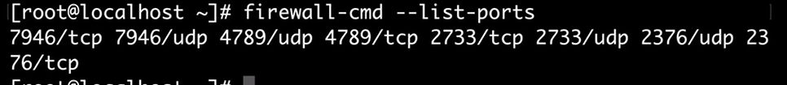
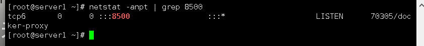
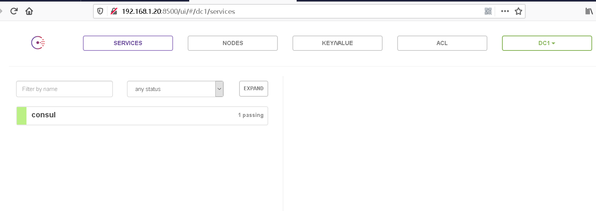
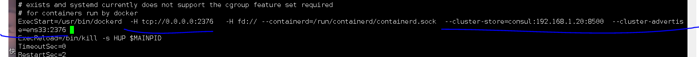
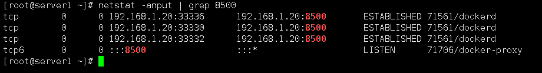
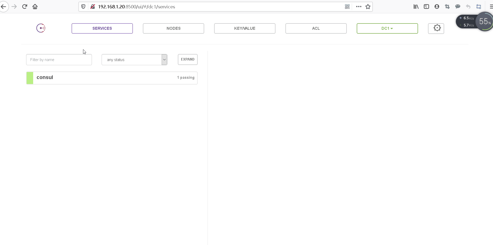

## 容器网络通讯

实现跨主机容器之间的通信

跨主机网络


原生网络：overlay 和 macvlan。

​    第三方方案：常用的包括 flannel、weave 和 calico


基于Vxlan的overlay网络， 将二层网络封装到UDP层进行传输，Vxlan提供了和vlan相同的二层以太网服务，但是拥有更好的扩展性

但是overlay需要key-value型数据库   非关系型数据库

（consul  etcd   zookeeper redis等）


# 部署overlay环境


实验环境

| 主机         | 主机名  |
| ------------ | ------- |
| 192.168.1.20 | server1 |
| 192.168.1.21 | server2 |


## 1. 先决条件

启动两台主机的docker服务

```
systemctl restart docker

#启动防护墙
systemctl restart firewalld
```

清除默认的防火墙规则

```
iptables -F

iptables-save
```


需要放行端口

```
2733  集群通信端口

7946 节点间通信

4789  覆盖网络通信

2376  docker服务端端口
```


#### 放行端口

```
firewall-cmd --permanent --add-port=7946/tcp

firewall-cmd --permanent --add-port=7946/udp

firewall-cmd --permanent --add-port=4789/tcp

firewall-cmd --permanent --add-port=4789/udp

firewall-cmd --permanent --add-port=2733/tcp

firewall-cmd --permanent --add-port=2733/udp


#单独开放docker常用端口（#其实只要开tcp就行了）

firewall-cmd --permanent --add-port=2376/tcp

firewall-cmd --permanent --add-port=2376/udp     
```

--permanent  //永久生效

防火墙重新读取参数

```
firewall-cmd --reload
```

查询防火墙中是否增加成功

```
firewall-cmd --list-ports
```



（同样，另一台主机也需要增加相同的操作）


### 修改两台主机的主机名

#### 第一台主机

```
hostname server1

bash
```

#### 第二台主机

```
hostname server2

bash
```

#### 


需要再主机中运行一个consul（用来存放docker主机的注册信息）

拉取镜像

```
docker pull progrium/consul
```


#### #创建consul容器（只在server1上创建）

```
docker run -d --restart always -p 8400:8400 -p 8500:8500 -p 8600:53/udp -h consul progrium/consul -server -bootstrap -ui-dir /ui
```

含义：

```
8500页面访问端口

8600 方便dns解析

-h consul    //指定名称（--name的缩写）

-server   以server状态独立运行

-bootstrap -ui-dir /ui   //开一个图形化来运行
```

查看端口

```
netstat -anput | grep  8500
```




访问主机ip+8500端口




然后我们将server1和server2都加入（两台主机要修改的相同

vim /usr/lib/systemd/system/docker.service

添加：


```
--cluster-store=consul://192.168.1.20:8500 --cluster-advertise=ens33:2376
```




```
--cluster-store=consul:192.168.1.20:8500   //对docker主机指定consul的地址是多少

--cluster-advertise=ens33:2376   //从ens33网卡的2376公布（根据自己的端口不同来设置网卡）
```

重启服务（会略慢）

```
systemctl daemon-reload
systemctl restart docker      
```

查看

```
netstat -anpt | grep docker
```

查看到8500号端口是开启的



访问主页




