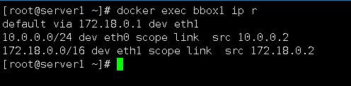

## 创建overlay网络


默认是基于docker swarm群集才能使用overlay网络，想要单机部署overlay网络，就必须打开网卡的混杂模式

### 网卡默认是没有打开混杂模式


开启ens33网卡的混杂模式

```
ifconfig ens33 promisc
```


会在网卡这里看到一个PROMISC（混杂模式）

如果想去掉混杂模式（加个-号即可）

```
ifconfig ens33 -promisc
```


### 创建网络

```
docker network create --driver overlay --attachable ov_net1
```

含义：

```
--driver overlay        //指定驱动器 网络模式是overlay模式

--attachable   //可以让我们在单机上使用overlay网络，而不必在swarm群集中使用

ov_net1      //网络名称
```


### 查看docker网络

```
docker network ls
```


发现我们创建了一个overlay模式的网络，网卡名称是ov_net1


我们要注意的一个地方是后面的SCOPE


global是代表对全局生效，而我们之前使用的local 是只对本地生效

然后我们在第二台主机上查看

```
docker network ls
```


发现和我们的主机是相同的，这就是代表网络模式是全局的


#查看ov_net1网络的详细信息

```
docker network inspect ov_net1
```


（这个网络的地址分配是10网段，网关是10.0.0.1，用于容器间通信）在主机上是查不到的

这样我们网络就创建好了


overlay中还可以创建一个桥接卡

#创建容器

```
docker run -itd --name bbox1  --network ov_net1 busybox
```

#查看容器的网卡

```
docker exec bbox1 ip r
```


发现创建的容器有两块网卡（eth0，eth1）

多出来了一块桥接卡


我们来查看一下

```
docker network ls
```

发现的确多出来了一块桥接卡


查看一下这块网卡的详细信息

```
docker network inspect docker_gwbridge 
```


可以看到，这块桥接卡的网关是172.18.0.1，我们出来看主机上的网卡

```
ip a
```


发现这块桥接卡是连接在物理网卡上的，还记得吗？ veth--peer，这就相当于桥接，容器中的eth1网卡的主机通过这块桥接卡就可以上网，实现了什么效果？，你既可以单独上网，也可以在集群中进行通信

我们来测试一下容器中是否可以ping通外网

```
docker exec bbox1 ping www.baidu.com
```


答案是可以的，这就证明了我们的思路是正确的

(这样我们容器间通信使用的是10.0.0.0网段，容器对外通信就使用172.18.0.0网段)

如果要容器对外通信就直接加-p映射出去


本章基于前面两章）overlay网络环境准备，overlay创建网络上进行操作

## 上节课遗留的问题（如何实现跨主机通信的）



eth0网卡是overlay网络的中容器间通信使用的网卡

eth1网卡是容器面对外网时通信使用的网卡 （对外桥接）


### 需要在  ”两台“  主机上开启路由转发功能（192.168.1.20，192.168.1.21）

```
echo net.ipv4.ip_forward = 1 >> /etc/sysctl.conf
sysctl -p
```


在第二台主机上（192.168.1.21）

创建容器

```
docker run -itd --name bbox2 --network ov_net1 busybox
```

查看

```
docker exec bbox2 ip r
```


发现我们的eth0网卡（容器间通信用的网卡） 向后推了一位变为了10.0.0.3，

说明了他们公用eth0网卡的网络（在同一网络中），

但是桥接卡还是172.18.0.2  那是因为桥接卡是当前容器对外通信的，不处于overlay网络中，只对本机有用


我们去测试一下192.168.1.21主机的容器bbox2能不能与192.168.1.20主机的bbox1容器进行通信

```
docker exec bbox2 ping bbox1
```


发现网络是可以通信的


#### 到此为止实验就算是做完了，实现了跨主机容器通信的功能


