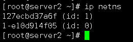
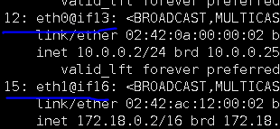

## 1.名称含义

```
Container（容器） eth0：eth0它是Overlay网络分配的唯一的IP地址，它是veth pair虚拟设备对，作用是实现点对点的通信，通过桥接到br0这个网桥中，可以实现不同 NameSwitch之间容器进行通信。

Container eth1：eth1是容器主机的默认网络，主要提供容器访问外网所提供的服务，走的默认docker网络架构，只不过他创建了docker_gwbridge这个网桥。

br0：它是Overlay默认创建的网桥。

docker_gwbridge：docker_gwbridge是容器所创建的网桥它替代了docker0的服务。

eth0：真机网卡与外界网卡连接得真机网卡，它用来转发，容器VXLAN与NAT两种网卡类型的数据包到指定的对端节点

eth1： 对外的桥接网卡

VETP：对VXLAN数据包的封装与解封装。
```


## 2.数据发送流程（详细版本）（看不懂没关系，看完这篇文章之后再看这个

容器Container1 发送数据包 到容器 Container2。

```
  1、容器Container1会通过Container eth0 将这个数据包发送到 10.0.0.1 的网关。

  2、网关将数据包发送出去后到达br0网桥。

  3、br0网桥针对VXLAN设备，主要用于捕获对外的数据包通过VETP进行数据包封装。

  4、封装好将VXLAN格式数据包交给eth0，通过UDP方式交给Container2的eth0。

  5、Container2收到数据包后通过VETP将数据包解封装。

  6、网桥通过网关将解封装的数据包转发给Container eth0，完毕通信。
```


## 


# 3. overlay网络的工作原理

## 实验流程 

查看网络空间net namespace

```
ip netns
```

发现查询不到


需要做个软连接 (两台主机)

```
ln -s /var/run/docker/netns/ /var/run/netns
```

然后再次查看




我们之前知道的，如果命名空间的数字相同，就在同一个空间内运行的，如果不相同即为隔离，

我们发现有一个空间是相同的 （1-e10d914f05）


查看这个地址的特点

```
ip netns exec 1-e10d914f05 brctl show
```


br0 是桥接卡


我们来查看一下他们的关系

```
docker exec -it bbox1 sh

ip a
```



发现容器中有两对网卡（12连接到了13网卡，15连接到了16网卡）

12-13 是容器间通信的网卡

15-16 是容器与物理机，桥接使用的网卡


我们在物理机上查看15-16的网卡


发现15-16网卡是可以找到的，它连接到的是外网地址，并且它连接到的是


eth1是网卡是peer端，veth0ddeab2是veth端，桥接到物理网卡。就可以上外网了


## 但是我们没有找到12-13的卡。


他们去那里去了呢？  他们被放到了另外一个空间范围内

```
ip netns exec 1-e10d914f05 ip a    //查看刚才查找到的相同网络名称空间的net namespace空间
```


我们找到了3块网卡

```
br0

vxlan0

12桥接13的网卡
```


eth0 连接的是veth0

（12桥接到13上，也就是容器桥接到这个网络名称空间中）


查看是如何桥接的

```
ip netns exec 1-e10d914f05 brctl show
```


可以看到有一块vxlan0的桥接卡


#查看vxlan0的网卡

```
ip netns exec 1-e10d914f05 ip -d l show vxlan0
```


```
11号网卡 是一个vxlan0    （实际上有256个，vlan ID有256个） 同一个id能通信
```

### 而veth是与vxlan之间是连接是依赖于br0

```
ip netns exec 1-e10d914f05 ip a
```


所有的地方都要指向br0，为什么那？ 因为只有br0才有ip 10.0.0.1，这些网段会转发到br0上，

所以其他网络应该指向br0，所以只有br0上有10.0.0.0/24，

```
veth0 --br0 ---vxlan0
```


这样我们就找回了丢失的网卡11，12-13，还有ns空间的网卡2

这样，网络空间的网卡就是 1网卡lo 和2网卡 br0


### 那么这里的网卡2会对物理机的网卡2有影响吗？


没有，因为ens33是在我们系统上的，而br0是在netns空间范围之内的


再开另一台主机（192.168.1.21） 他的操作和刚才的基本一样

```
docker exec -it bbox2 sh
```

查看

```
ip a
```


14桥接15网卡使用的是容器间通信的，这个网卡链接是存放在netns空间中的，在物理机上是查不到的，16桥接到17是支持容器对外通信的可以查看到，退出容器查看。


只有一个被桥接的卡17证明刚才的理论


## 

## 我们跨主机通信走的vxlan结构

那么网络是如何隔离的那？（网络的隔离性）


试着创建另一套网络

```
docker network create --driver overlay --attachable ov_net2
```

查看网络信息和刚才的ov_net2又不再同一地址段

```
docker network inspect ov_net2
```


创建个容器

```
docker run -itd --name bbox3 --network ov_net2 busybox
```

然后查看

```
docker exec bbox3 ip r
```


很明显，他被分配到了另外一个地址段

eth1因为是桥接卡，只在本地上生效，所以依旧延续172.18.0.0网段


## 在主机2上（192.168.1.21)上也创建一个容器

```
docker run -itd --name bbox4 --network ov_net2 busybox
```

然后去ping 刚才创建的容器们

```
docker exec -it bbox4 sh

ping bbox1
ping bbox2
ping bbox3
```


发现并不会通，因为他们 被隔离了(我们bbox1和bbox2是一个网络，bbox3和bbox4是在同一个网络)

并且我们容器中的172.18.0.0网段的地址能和其他容器的172.x.x.x通信吗？

不能，因为他们仅仅限于在本地使用（针对外网的）

所以说，不同的网络不能通信


## 怎么让他们通呢？

做一个连接网络(把ov_net1网络添加到bbox3容器上)

```
docker network connect ov_net1 bbox3   //这样bbox3就有了ov_net1的网络
```

进入容器

```
docker exec -it bbox3  sh
```

查看

```
ip r
```


在网卡上多出了一块10.0.1.0网段的网卡

这样bbox3就可以去ping通信bbox1和bbox2了


## #overlay网络配置自定义指定ip

```
docker network create --driver overlay --subnet 10.22.1.0/24 --gateway 10.22.2.1  ov_net3   //指定了容器的ip地址和网关
```


## 后记


```
vxlan是网络虚似化通道，

eth0 IP 为 10.0.0.2，连接的是 overlay 网络 ov_net1。

eth1 IP 172.17.0.2，容器的默认路由是走 eth1，eth1 是哪儿来的呢？ 

eth1是我们依据网卡docker_gwbridge创建容器时生成的一个链接网卡，用于容器与外界通信


docker_gwbridge的作用：

docker 会创建一个 bridge 网络 “docker_gwbridge”，为所有连接到 overlay 网络的容器提供访问外网的能力


docker 会为每个 overlay 网络创建一个独立的 network namespace，其中会有一个 linux bridge br0，endpoint 还是由 veth pair 实现，一端连接到容器中（即 eth0），另一端连接到 namespace 的 br0 上                      

br0 除了连接所有的 endpoint，还会连接一个 vxlan 设备，用于与其他 host 建立 vxlan tunnel。容器之间的数据
```


 


 


