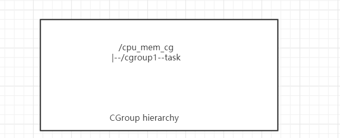
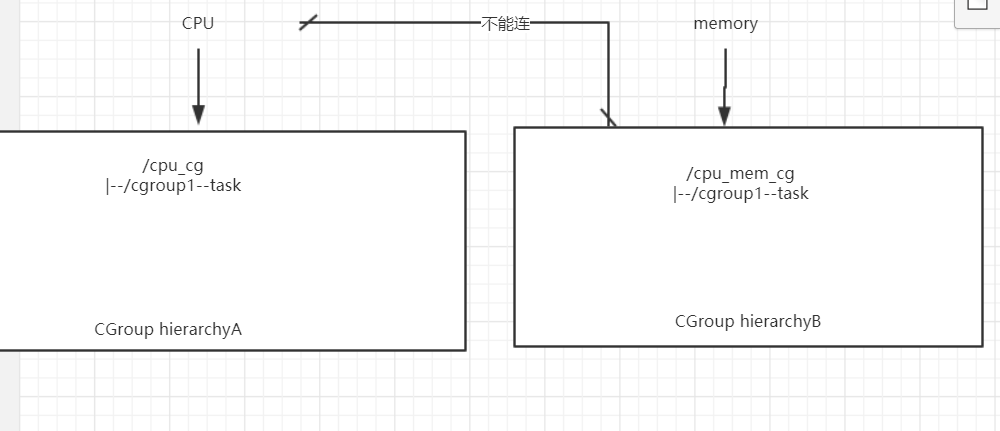

docker 第三天


启动服务

外部命令：安装服务后生成的

内部命令：包括在系统内核中


找不到服务启动的命令

```
在vim /usr/lib/systemd/system/docker.service （文件中找到execstart中找到启动命令）

并进行启动
```

实验：利用ssh远程操作

docker run -itd --name sshd centos:latest /bin/bash

yum install iproute passwd openssh-server openssl-clients -y

passwd root


### 启动sshd服务（由于没有文件内容，会显示）

/usr/sbin/sshd -D

### 把以上的三个文件填充内容

ssh-keygen -q -t rsa -b 2048 -f /etc/ssh/ssh_host_rsa_key -N ''

cat /etc/ssh/ssh_host_rsa_key

ssh-keygen -q -t rsa -b 2048 -f /etc/ssh/ssh_host_ecdsa_key -N '' 
cat /etc/ssh/ssh_host_ecdsa_key

ssh-keygen -q -t rsa -b 2048 -f /etc/ssh/ssh_host_ed25519_key -N '' 
cat /etc/ssh/ssh_host_ed25519_key

### 编辑文件

vi  /etc/ssh/sshd_config

```
#UsePAM no    热插拔模块

UsePrivilegeSeparation no

PermitRootLogin yes    开启root权限
```

### 后台启动sshd服务

/usr/sbin/sshd -D &

jobs

ip add

 exit


### 放入nginx软件包到宿主机

docker cp   文件   容器名：路径

docker cp nginx-1.6.0.tar.gz sshd:/root

ssh root@172.17.0.2

cd /root

tar -zxvf nginx-1.6.0.tar.gz

cd nginx-1.6.0

yum -y install pcre pcre-devel openssl openssl-devel zlib make  gcc-c++

useradd -M -s /sbin/nologin nginx

./configure --prefix=/usr/local/nginx --user=nginx --group=nginx && make && make install

ln -s /usr/local/nginx/sbin/* /usr/local/sbin/

nginx

exit

访问即可

curl  172.17.0.2


使用图形化配置ip

nmtui


# docker核心原理cgroup

以前是“把用户放到组中，对组进行设置权限”

Cgroups 是 control groups 的缩写，是 Linux 内核提供的一种可以限制、记录、隔离进程组（process groups）所使用的物理资源（如：cpu,memory,IO等等）的机制。把进程（tasks）放到组里面，对组进行设置


## cgroup的作用

限制进程组可以使用的资源数量（Resource limiting ）。比如：memory子系统可以为进程组设定一个memory使用上限，一旦进程组使用的内存达到限额再申请内存，就会出发OOM（out of memory）。

进程组的优先级控制（Prioritization ）。比如：可以使用cpu子系统为某个进程组分配特定cpu share。

记录进程组使用的资源数量（Accounting ）。比如：可以使用cpuacct子系统记录某个进程组使用的cpu时间

进程组隔离（Isolation）。比如：使用ns子系统可以使不同的进程组使用不同的namespace，以达到隔离的目的，不同的进程组有各自的进程、网络、文件系统挂载空间。

进程组控制（Control）。比如：使用freezer子系统可以将进程组挂起和恢复。

#### 总结：

1.资源控制：禁止超出某个限制

2.优先级分配：blkio   可以使用cpu子系统为某个进程组分配特定cpu share。

3.资源统计：比如：可以使用cpuacct子系统记录某个进程组使用的cpu时间

4.进程控制：比如：使用freezer子系统可以将进程组挂起和恢复。


## 术语：

```
#### task：表示一个或者一组进程（系统进程）

#### cgroup：以ｃｇｒｏｕｐ为单位来实现。比如一组二组三组，一个用户只能放到一个组中，然后对组设置权限    （控制实现单位）

#### subsystem：子系统，是资源调度控制器，比如：分配使用时间，分配内存大小

#### hierarchy：层次，由一系列的ｃｇｒｏｕｐ排列而成的层级。（也称作层级树）   逻辑上的结构

 
```

```
规则1 ：同一个hierarchy可以附加一个或多个subsystem
```



```
规则2：一个已经附加到某个hierarchy上的subsystem 不能附加到其他含有别的subsystem的hierarchy
```




```
规则3：一个task不能属于同一个hierarchy的不同cgroup
```


```
规则4：刚fork出的子进程在初始状态与父进程处于同一个cgroup
```


安装从group

 yum -y install libcgroup-tools

lscgroup 　／／查看当前的主机中存在的控制组

lssubsys -a 	／／查看所有的子系统

```
subsystem的控制选项：
cpuset：为 cgroup中的task分配独立cpu
cpu：调度程序控制task对CPU的使用
cpuacct：自动生成CPU资源的使用情况报告
memory：对内存用量的使用限制。同时可以生成使用报告
devices：开启、/关闭cgroup中的task对设备的访问。
freezer：挂起/恢复cgroup当中的task
net_cls,net_prio：没有直接使用。通过等级识别符号（classid）标记网络数据，从而控制流量
blkio：为快设备输入或输出的限制
perf_event：统一的性能限制
hugetlb：没有被启用
pids：单独对某个 pid进行限制

```


小实验：对docker的限制

对CPU的限制 （优先级限制    ）

```
-c

-cpu-share
```

需要宿主机该为单核cpu

docker pull progrium/stress

docker run  --naem   testA --cpu-shares 1024 progrium/stress  --cpu 1 /bin/bash

docker run  --name   testB --cpu-shares 512 progrium/stress  --cpu 1 /bin/bash

直接查看即可

查看top（进程占用情况）   ---


内存限制

-m/--memory:限制内存的使用资源

--memory-swap:限制内存加swap分区大小

正常运行

 docker  run -itd -m 200M  --memory-swap=300M  progrium/stress

中断   使用内存超出

 docker  run -itd -m 200M  --memory-swap=300M  progrium/stress  --vm 1  --vm-bytes 380M


--blkio-weight

bps/iops：

device-read-bps

device-write-bps

device-read-iops

device-write-iops


docker run -it   --device-write-bps /dev/sda:30MB centos

time dd if=/dev/zero of=test.out bs=1M count=800  oflag=direct


实验：（把虚拟机调到四核）

查看宿主机的cpu个数


test1允许使用第一颗ｃｐｕ

test2允许使用第二颗ｃｐｕ

docker run -itd --name test1  --cpuset-cpus 0 centos  --cpu 1 

docker run -itd --name test2  --cpuset-cpus 1 　centos　--cpu 1 　　　／／允许谁可以用这个ｃｐｕ，冲突情况下看权重


subsystem配置参数用法

（1）blkio - BLOCK IO资源控制

 ● 限额类 限额类是主要有两种策略，一种是基于完全公平队列调度（CFQ：Completely Fair Queuing ）的按权重分配各个cgroup所能占用总体资源的百分比，好处是当资源空闲时可以充分利用，但只能用于最底层节点cgroup的配置；另一种则是设定资源使用上限，这种限额在各个层次的cgroup都可以配置，但这种限制较为生硬，并且容器之间依然会出现资源的竞争。

   ○ 按比例分配块设备IO资源

   ○ blkio.weight：填写100-1000的一个整数值，作为相对权重比率，作为通用的设备分配比。

   ○ blkio.weight_device： 针对特定设备的权重比，写入格式为device_types:node_numbers weight，空格前的参数段指定设备，weight参数与blkio.weight相同并覆盖原有的通用分配比。{![查看一个设备的device_types:node_numbers可以使用：ls -l /dev/DEV，看到的用逗号分隔的两个数字就是。有的文章也称之为major_number:minor_number。]}

   ○ 控制IO读写速度上限

​     i. blkio.throttle.read_bps_device：按每秒读取块设备的数据量设定上限，格式device_types:node_numbers bytes_per_second。

​     ii. blkio.throttle.write_bps_device：按每秒写入块设备的数据量设定上限，格式device_types:node_numbers bytes_per_second。

​     iii. blkio.throttle.read_iops_device：按每秒读操作次数设定上限，格式device_types:node_numbers operations_per_second。

​     iv. blkio.throttle.write_iops_device：按每秒写操作次数设定上限，格式device_types:node_numbers operations_per_second

   ○ 针对特定操作(read, write, sync, 或async)设定读写速度上限

​     i. blkio.throttle.io_serviced：针对特定操作按每秒操作次数设定上限，格式device_types:node_numbers operation operations_per_second

​     ii. blkio.throttle.io_service_bytes：针对特定操作按每秒数据量设定上限，格式device_types:node_numbers operation bytes_per_second

 ● 统计与监控 以下内容都是只读的状态报告，通过这些统计项更好地统计、监控进程的 io 情况。

   a. blkio.reset_stats：重置统计信息，写入一个int值即可。

   b. blkio.time：统计cgroup对设备的访问时间，按格式device_types:node_numbers milliseconds读取信息即可，以下类似。

   c. blkio.io_serviced：统计cgroup对特定设备的IO操作（包括read、write、sync及async）次数，格式device_types:node_numbers operation number

   d. blkio.sectors：统计cgroup对设备扇区访问次数，格式 device_types:node_numbers sector_count

   e. blkio.io_service_bytes：统计cgroup对特定设备IO操作（包括read、write、sync及async）的数据量，格式device_types:node_numbers operation bytes

   f. blkio.io_queued：统计cgroup的队列中对IO操作（包括read、write、sync及async）的请求次数，格式number operation

   g. blkio.io_service_time：统计cgroup对特定设备的IO操作（包括read、write、sync及async）时间(单位为ns)，格式device_types:node_numbers operation time

   h. blkio.io_merged：统计cgroup 将 BIOS 请求合并到IO操作（包括read、write、sync及async）请求的次数，格式number operation

   i. blkio.io_wait_time：统计cgroup在各设备中各类型IO操作（包括read、write、sync及async）在队列中的等待时间(单位ns)，格式device_types:node_numbers operation time

   j. __blkio.__recursive_*：各类型的统计都有一个递归版本，Docker中使用的都是这个版本。获取的数据与非递归版本是一样的，但是包括cgroup所有层级的监控数据。

（2） cpu - CPU资源控制

CPU资源的控制也有两种策略，一种是完全公平调度 （CFS：Completely Fair Scheduler）策略，提供了限额和按比例分配两种方式进行资源控制；另一种是实时调度（Real-Time Scheduler）策略，针对实时进程按周期分配固定的运行时间。配置时间都以微秒（µs）为单位，文件名中用us表示。

 ● CFS调度策略下的配置

   ○ 设定CPU使用周期使用时间上限

   ○ cpu.cfs_period_us：设定周期时间，必须与cfs_quota_us配合使用。

   ○ cpu.cfs_quota_us ：设定周期内最多可使用的时间。这里的配置指task对单个cpu的使用上限，若cfs_quota_us是cfs_period_us的两倍，就表示在两个核上完全使用。数值范围为1000 - 1000,000（微秒）。

   ○ cpu.stat：统计信息，包含nr_periods（表示经历了几个cfs_period_us周期）、nr_throttled（表示task被限制的次数）及throttled_time（表示task被限制的总时长）。

   ○ 按权重比例设定CPU的分配

   ○ cpu.shares：设定一个整数（必须大于等于2）表示相对权重，最后除以权重总和算出相对比例，按比例分配CPU时间。（如cgroup A设置100，cgroup B设置300，那么cgroup A中的task运行25%的CPU时间。对于一个4核CPU的系统来说，cgroup A 中的task可以100%占有某一个CPU，这个比例是相对整体的一个值。）

 ● RT调度策略下的配置 实时调度策略与公平调度策略中的按周期分配时间的方法类似，也是在周期内分配一个固定的运行时间。

   a. cpu.rt_period_us ：设定周期时间。

   b. cpu.rt_runtime_us：设定周期中的运行时间。

（3） cpuacct - CPU资源报告

这个子系统的配置是cpu子系统的补充，提供CPU资源用量的统计，时间单位都是纳秒。

 \1. cpuacct.usage：统计cgroup中所有task的cpu使用时长

 \2. cpuacct.stat：统计cgroup中所有task的用户态和内核态分别使用cpu的时长

 \3. cpuacct.usage_percpu：统计cgroup中所有task使用每个cpu的时长

（4）cpuset - CPU绑定

为task分配独立CPU资源的子系统，参数较多，这里只选讲两个必须配置的参数，同时Docker中目前也只用到这两个。

 \1. cpuset.cpus：在这个文件中填写cgroup可使用的CPU编号，如0-2,16代表 0、1、2和16这4个CPU。

 \2. cpuset.mems：与CPU类似，表示cgroup可使用的memory node，格式同上

（5） device - 限制task对device的使用

 ● **设备黑/白名单过滤 **

   a. devices.allow：允许名单，语法type device_types:node_numbers access type ；type有三种类型：b（块设备）、c（字符设备）、a（全部设备）；access也有三种方式：r（读）、w（写）、m（创建）。

   b. devices.deny：禁止名单，语法格式同上。

 ● 统计报告

   a. devices.list：报告为这个 cgroup 中的task设定访问控制的设备

（6） freezer - 暂停/恢复cgroup中的task

只有一个属性，表示进程的状态，把task放到freezer所在的cgroup，再把state改为FROZEN，就可以暂停进程。不允许在cgroup处于FROZEN状态时加入进程。 * **freezer.state **，包括如下三种状态： - FROZEN 停止 - FREEZING 正在停止，这个是只读状态，不能写入这个值。 - THAWED 恢复

（7） memory - 内存资源管理

 ● 限额类

   a. memory.limit_bytes：强制限制最大内存使用量，单位有k、m、g三种，填-1则代表无限制。

   b. memory.soft_limit_bytes：软限制，只有比强制限制设置的值小时才有意义。填写格式同上。当整体内存紧张的情况下，task获取的内存就被限制在软限制额度之内，以保证不会有太多进程因内存挨饿。可以看到，加入了内存的资源限制并不代表没有资源竞争。

   c. memory.memsw.limit_bytes：设定最大内存与swap区内存之和的用量限制。填写格式同上。

 ● 报警与自动控制

   a. memory.oom_control：改参数填0或1， 0表示开启，当cgroup中的进程使用资源超过界限时立即杀死进程，1表示不启用。默认情况下，包含memory子系统的cgroup都启用。当oom_control不启用时，实际使用内存超过界限时进程会被暂停直到有空闲的内存资源。

 ● 统计与监控类

   a. memory.usage_bytes：报告该 cgroup中进程使用的当前总内存用量（以字节为单位）

   b. memory.max_usage_bytes：报告该 cgroup 中进程使用的最大内存用量

   c. memory.failcnt：报告内存达到在 memory.limit_in_bytes设定的限制值的次数

   d. memory.stat：包含大量的内存统计数据。

   e. cache：页缓存，包括 tmpfs（shmem），单位为字节。

   f. rss：匿名和 swap 缓存，不包括 tmpfs（shmem），单位为字节。

   g. mapped_file：memory-mapped 映射的文件大小，包括 tmpfs（shmem），单位为字节

   h. pgpgin：存入内存中的页数

   i. pgpgout：从内存中读出的页数

   j. swap：swap 用量，单位为字节

   k. active_anon：在活跃的最近最少使用（least-recently-used，LRU）列表中的匿名和 swap 缓存，包括 tmpfs（shmem），单位为字节

   l. inactive_anon：不活跃的 LRU 列表中的匿名和 swap 缓存，包括 tmpfs（shmem），单位为字节

   m. active_file：活跃 LRU 列表中的 file-backed 内存，以字节为单位

   n. inactive_file：不活跃 LRU 列表中的 file-backed 内存，以字节为单位

   o. unevictable：无法再生的内存，以字节为单位

   p. hierarchical_memory_limit：包含 memory cgroup 的层级的内存限制，单位为字节

   q. hierarchical_memsw_limit：包含 memory cgroup 的层级的内存加 swap 限制，单位为字节


s