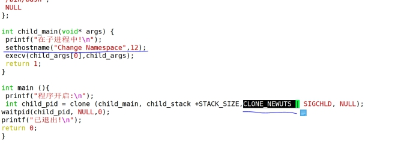

docker第二天


有虚拟化演变

OpenStack  造就阿里云   腾讯云

container 

每台centos主机上都有容器podman  他与docker的命令一样


docker核心原理namespace（安卓系统是Linux系统）


通信原理


 USER通过shell（bash/zsh）发送指令给OS，
 OS发送通知lib库准备好运行环境，
 lib库准备好通知soft可以运行了，
 soft进行操作将指令下发给device执行。 

计算机结构：

硬件: kernel 、用于控制硬件，操作系统来控制内核如何工作,（内核如何工作取决于系统中安装了什么样的应用），指令通过shell进行转换为计算机语言，通过指令集（command）

微软提供的图形化界面其实就是一个shell环境（expoler）

.dll:动态链接数据库（lib库）

库文件是用来帮助操作系统来控制软件的 

驱动程序：用来帮助系统控制硬件，下达一系列的特殊指令，可以说是一种中间件程序


docker在使用过程中如何去理解：

虚拟化

解耦：

半解耦：

什么是耦合：一般来说，如果两种食物之间如果存在一种相互作用相互影响的关系，那么这种关系就称为耦合关系

硬件解耦：将硬件资源平均切割开来，不让其产生冲突（硬件资源是可以被切割开来的）

## 解耦

当我们在同一个操作系统中运行相同的软件程序时，它们会发生冲突。解除耦合则是为一个软件分配一个环境，使其独立运行。
例如手机里的应用分身，还有经常使用的VMware虚拟机也是使用这种方式
当我们想要同时运行多个web服务器时，需要创建两个操作系统，
从指定硬件层面（CPU、MEM、DISK）→安装内核→安装系统→安装lib库→安装device（驱动程序）→安装应用软件

## 半解耦

使得在同一个环境下可以同时运行两个相同的软件，分担软件服务器的压力。
直接使用物理机上的硬件资源（CPU、MEM、DISK）和kernel(内核)
例如：docker会直接使用系统镜像构建出一个容器，以文件夹的方式存放在操作系统上。


hypervisor  隔离


六项隔离

/proc： 在centos中pid文件的录入端口

vim example.c      是C语言脚本  可以在一台虚拟机上开启多台shell  

```
#define _GNU_SOURCE
#include <sys/types.h>
#include <sys/wait.h>
#include <stdio.h>
#include <sched.h>
#include <signal.h>
#include <unistd.h>

#define STACK_SIZE (1024 * 1024)

static char child_stack[STACK_SIZE];
char* const child_args[] = { 
"/bin/bash",
 NULL
};  
    
int child_main(void* args) {
 printf("在子进程中! \n");
 execv(child_args[0],child_args);
 return 1;
}

int main (){
 printf("程序开启: \n");
 int child_pid = clone (child_main, child_stack +STACK_SIZE, SIGCHLD, NULL);
waitpid(child_pid, NULL,0);
printf("已退出! \n");
return 0;
}

```


运行脚本   

gcc  -Wall    example.c  -o  aut.o      //编译打包成应用程序

进入应用程序

aut.o


## 隔离主机名

添加：

 

出现下面的两种主机名,说明隔离主机名成功！！！！

 

 

 

 

## 隔离消息列队

 

 

ipcs -q 	查看消息列队

ipcmk -Q 创建列队

[root@localhost ~]# gcc -Wall fork_example.c -o ipc.out  && ./ipc.out

 

 

 

```
ipc  信号量、消息队列和共享内存

mnt  挂载点（文件系统隔离）

net  网络隔离、网络栈、端口等

pid  进程编号

user  用户和组

uts 主机名和域名
```


1、显示所有的IPC设施

\# ipcs -a

2、显示所有的消息队列Message Queue

\# ipcs -q

3、显示所有的信号量

\# ipcs -s

4、显示所有的共享内存

\# ipcs -m

5、显示IPC设施的详细信息

\# ipcs -q -i id

id 对应shmid、semid、msgid等。-q对应设施的类型（队列），查看信号量详细情况使用-s，查看共享内存使用-m。

6、显示IPC设施的限制大小

\# ipcs -m -l

-m对应设施类型，可选参数包括-q、-m、-s。

7、显示IPC设施的权限关系

\# ipcs -c

\# ipcs -m -c

\# ipcs -q -c

\# ipcs -s -c

8、显示最近访问过IPC设施的进程ID。

\# ipcs -p

\# ipcs -m -p

\# ipcs -q -p

9、显示IPC设施的最后操作时间

\# ipcs -t

\# ipcs -q -t

\# ipcs -m -t

\# ipcs -s -t

10、显示IPC设施的当前状态

\# ipcs -u

Linux上的ipcs命令，不支持UNIX上的-b、-o指令，同样UNIX中不支持-l、-u指令，所以在编写跨平台的脚本时，需要注意这个问题。


# pid隔离


 

[root@localhost ~]# gcc -Wall fork_example.c -o pid.out  && ./pid.out

 

Ehco $$ 脚本运行当前进程号

但是退出子程序以后查看proxy发现子程序里是1（bin/shell），而主程序里也有1（systemd）会发生混乱！

原因：程序要运行首先要把硬盘里的一部分东西拿出来放到内存里，让电脑随时随地调取，然后就会产生pid编号，pid编号和内存里的东西是对应的，放到一个文件夹里，文件夹放到了proxy目录下，然后在主程序与子程序之间做了一个隔离，发现这个子程序进程的id是1777（不同）但是进去以后再查看变成1，但是主程序已经有一个1（systemd）但是子程序的1变成了bin/shell（这样就会发生混乱，因为proxy目录不相同），因为子程序（容器）没有开机启动顺序没有开启第一个进程，容器不需要开机。


# mount  隔离

主机有两个proc文件，命名空间链接其中一个，链接的哪一个为一样


 gcc -Wall example.c -o mount.o

./mount.o

 

1、主从挂载（master影响slave，slave不影响master）

2、共享挂载（相互影响）

3、私密挂载（private 互不影响） 两边数据不一致

4、不可绑定的挂载 （unbindable） 


提权  (对已有的容器进行    一般情况下不进行有风险)

docker  run  --restart always -d  --name test  --privieged  centos  /sbin/init


veth-peer

容器A   ------容器B

通过主机的桥接卡docker0进行通讯

## ***\*网络隔离：\****

例子：

```
[root@localhost ~]# ip netns add test_ns		##创建一个网络

[root@localhost ~]# ip netns exec test_ns ip link list	##查看当前的状态

[root@localhost ~]# ip netns exec test_ns ping 127.0.0.1		##ping自己查看自己是否可以ping通

[root@localhost ~]# ip netns exec test_ns ip link set dev lo up	##开启地址

[root@localhost ~]# ip link add veth0 type veth peer name veth1		##veth0连接veth1

[root@localhost ~]# ip link set veth1 netns test_ns		#把veth1放到test_ns

[root@localhost ~]# ip netns exec test_ns ifconfig veth1 10.1.1.1/24 up		##给test_ns设置IP地址

[root@localhost ~]# ip netns exec test_ns ip a			##查看test_ns 是否配置上IP

[root@localhost ~]# ifconfig veth0 10.1.1.2 up		##给自己本地设置地址


[root@localhost ~]# ip netns exec test_ns iptables -L		##查看容器防火墙

[root@localhost ~]# ip netns del test_ns		#删除
```


实验：


 

 

### 创建两个空间

```
ip netns add test_ns1

ip netns add test_ns
```

 

### 查看

 

 

### 启动两个空间的网卡

```
ip netns exec test_ns ip link set dev lo up  

ip netns exec test_ns1 ip link set dev lo up  
```

 

### 为每个空间创建veth（创建两条veth-peer通道）

```
ip link add veth0 type veth peer name veth1

ip link add veth3 type veth peer name veth2

 
```

 

### 把veth 添加到空间中

```
ip link set veth1 netns test_ns

ip link set veth2 netns test_ns1
```

 

 

### 为空间添加ip

```
ip netns exec test_ns ifconfig veth1 10.1.1.2/24 up

ip netns exec test_ns1 ifconfig veth2 20.1.1.2/24 up
```

 

### 为主机与空间桥接的网卡编辑ip

```
ifconfig veth0 10.1.1.1/24 up

ifconfig veth3 20.1.1.1/24 up
```

 

### 为空间添加网关

```
ip netns exec test_ns route add default gw 10.1.1.1

ip netns exec test_ns1 route add default gw 20.1.1.1
```

 

### 添加路由转换

```
vim /etc/sysctl.conf

添加：

net.ipv4.ip_forward = 1

 

sysctl -p
```

 

 

#### 测试：

 