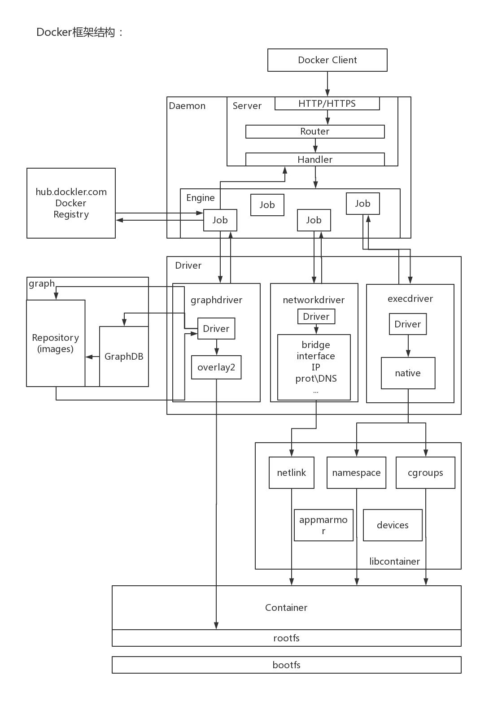
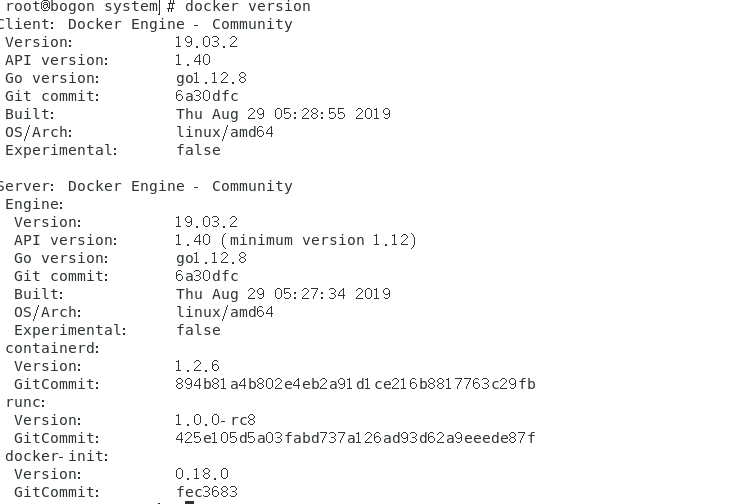
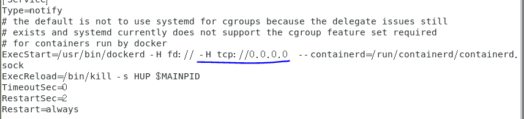
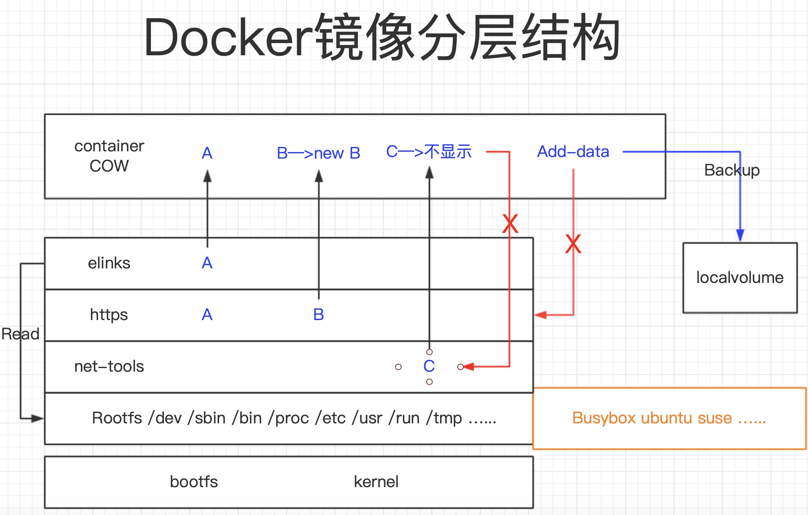

docker第四天


分为docker  server  和docker   client

docker 版本又分为docker ee  和docker ce



客户端发送http请求到服务端，服务端决定把请求交给那个容器进行处理

```
Docker Client和Docker Daemon之间建立通信，client并发送请求给daemon。而Docker Daemon作为Docker架构中的主体部分，首先提供Server的功能使其可以接受Docker Client的请求；而后Engine执行Docker内部的一系列工作，每一项工作都是以一个Job的形式的存在。

Job的运行过程中，当需要容器镜像时，则从Docker Registry中下载镜像，并通过镜像管理驱动graph driver将下载镜像以Graph的形式存储到graphDB（数据库）中；当需要为Docker创建网络环境时，通过网络管理驱动networkdriver创建并配置Docker容器网络环境；当需要限制Docker容器时，则通过execdriver来创建namespace和cgroup来完成。

而lib container是容器库文件，network driver以及exec driver都是通过lib container来实现具体对容器进行的操作。当执行完运行容器的命令后，一个实际的Docker容器就处于运行状态，该容器拥有独立的文件系统，独立并且安全的运行环境等

```


```
Docker Client：发送请求

Docker Daemon：常驻后台，用来接收与处理客户端发来的请求

Docker Server：路由与分发调度

​	http server：接待访问的时候，docker采用的协议

router：路由

Handler：分发请求（请求的类型（打开，运行，创建））

Engine(CE/EE)：开启大量Job

Job：真正负责工作的工作单元（工作线程，每当有数据请求，就会形成一个job）

当容器所需镜像不在本地时会上网自动抓取

Docker Registry：外网容器仓库，比如hub.docker.com/daocloud.io/aliyun.com

Graph：本地下载镜像的保管者

GraphDB：SQLite数据库，存放镜像之间的关系

Repositroy（images）：镜像存放

Driver

graph Driver：存储驱动，ubuntu中是aufs，centos中是overlay2

Network Driver：网络驱动，创建IP地址、端口号等，bridge——docker0

Exec Driver:创建命名空间与CGroup  执行驱动

libcontainer（容器库文件）：提供标准的接口，满足容器的操控
```


```
![b6a92a40634521aae9fa32bf5ac6ff6](../../../AppData/Local/Temp/WeChat Files/b6a92a40634521aae9fa32bf5ac6ff6.jpgrootfs：映射文件：里面包括了（/proc /bin.. 包括基本的命令，工具集）就是操作系统作用：（支持多个操作系统的运行，所有的形式都是链接过来的）


rootfs里面有：busybox（嵌入式系统）
	当我们的操作系统运行的时候，如何和我们相同的时候直接运行rootfs，如果不相同的时候，使用busybox模拟某个操作系统的rootfs

bootfs：包含 boot loader 和 kernel。用户不会修改这个文件系统。实际上，在启动（boot）过程完成后，整个内核都会被加载进内存，此时 bootfs 会被卸载掉从而释放出所占用的内存
rootfs：包含典型的目录结构，包括 /dev, /proc, /bin, /etc, /lib, /usr, and /tmp 等再加上要运行用户应用所需要的所有配置文件，二进制文件和库文件。这个文件系统在不同的Linux 发行版中是不同的。而且用户可以对这个文件进行修改
```


docker和 客户端的分离

docker version



vim /usr/lib/systemd/system/docker.service



systemctl daemon-reload
systemctl restart docker


## 镜像分层：

base镜像：base镜像有两层含义

2. ```
   （1.不依赖其他镜像，从scratch扩建 
   
   2. 其他景象可以之为基础进行扩展），
   3. 其实base镜像提供的就是最小安装的linux发行版
   ```

   

 

最小的镜像（hello-world）

最小的操作系统： alpine


查看镜像分层：

docker history  加 镜像名


 vim Dockerfile

```
FROM centos:latest
RUN yum -y install net-tools
RUN yum -y install elinks
RUN yum -y install httpd
CMD ["/bin/bash"]       最后启动的命令

```




```
镜像层：里面是冷数据：里面的数据不会产生变化，容器层读取数据镜像层数据由上到下的顺序读取数据)readonly写入端
容器层（Cibtauber）：里面是热数据：增删改查会产生变化 重启容器会丢失数据，需要做一间事情（持久化或者存储）writte读取端 
修改镜像层数据：假设修改容器层读取出来的数据，对c3修改生成一个新的数据C3newC4直接保存到镜像层，不会保存在镜像层里面，
	删除镜像层数据：假设删除容器层的D5，这个时候你在容器层里面就看不见D5，但是D5依旧存在镜像层里面
	一旦关闭镜像层镜像层里面的数据全部消失，
```

镜像的小原因是他用的是物理机的内核， 如果他的rootfs 有与物理机相同的目录 例（/dev, /proc, /bin, /etc, /lib, /usr, and /tmp），则会使用物理机的。而且他读取数据的时候只会读取上分的相同数据，在容器层做出的有状态的数据会保存在物理机本地，。镜像层是不会修改的


## 进行创建镜像

```
 docker build -t centos-net-http .

查看已经构建的镜像
docker images

 docker run -it --name dxh centos-net-http

进行验证：

ifconfig
elinks http://172.17.0.2
```


--no-cache  不使用缓存（会重新装一遍，占用磁盘等同大小）


dockerfile的内部常用指令：

```
FROM：指定 base 镜像。

COPY：将文件从 build context 复制到镜像

MAINTAINER ：设置镜像的作者，可以是任意字符串。

ADD：与 COPY 类似，从 build context 复制文件到镜像。不同的是，如果 src 是归档文件（tar, zip, tgz, xz 等），文件会被自动解压到 dest。

ENV：设置环境变量，环境变量可被后面的指令使用。例如：

ENV MY_VERSION 1.3
RUN apt-get install -y mypackage=$MY_VERSION

EXPOSE：容器内的服务为监听什么端口
VOLUME：将文件或目录声明为 volume。我们会在容器存储部分详细讨论。

WORKDIR：为后面的 RUN, CMD, ENTRYPOINT, ADD 或 COPY 指令设置镜像中的当前工作目录。

RUN：在容器中运行指定的命令。

CMD：容器启动时运行指定的命令。

Dockerfile 中可以有多个 CMD 指令，但只有最后一个生效。CMD 可以被 docker run 之后的参数替换。
开机程序自动启动 -g
CMD ["nginx","-g","daemon off;"]

ENTRYPOINT：设置容器启动时运行的命令。
CMD： 启动镜像的时候默认启动的命令
Dockerfile 中可以有多个 ENTRYPOINT 指令，但只有最后一个生效。CMD 或 docker run 之后的参数会被当做参数传递给 ENTRYPOINT

CMD & ENTRYPOINT
RUN执行命令并且创建镜像层，经常用于安装软件包。
CMD容器启动后默认执行的命令。但是会被docker run后面的参数替代
ENTRYPOINT配置容器启动时运行的命令。
	一定会生效，但是只能有最后一个结果

在Dockerfile中，只能有一个ENTRYPOINT指令，如果有多个ENTRYPOINT指令则以最后一个为准。
在Dockerfile中，只能有一个CMD指令，如果有多个CMD指令则以最后一个为准。
在Dockerfile中，ENTRYPOINT指令或CMD指令，至少必有其一。
  在Dockerfile中，如果同时出现CMD和ENTRYPOINT的话会覆盖CMD的命令
	如果NETRYPOINT提前执行那么CMD会变成NETRYPOINT的参数
```


 


