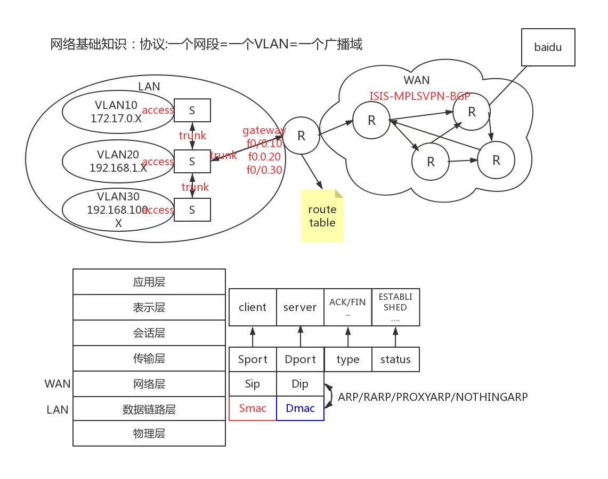
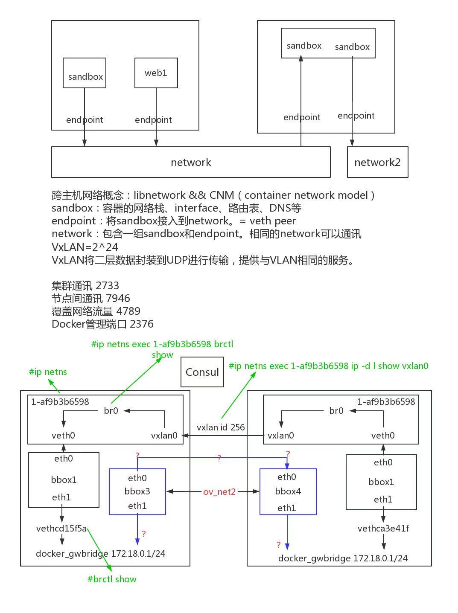
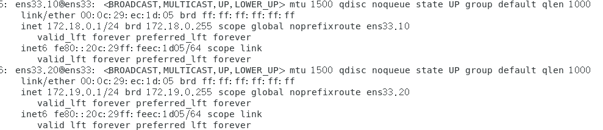
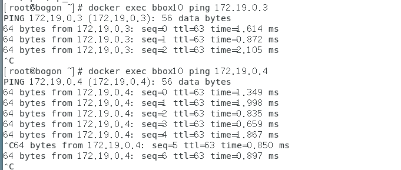

overlay网络创建与原理

网络基础知识：

公网：有ISIG  MPLSvpn  bgp等协议

和私网







## macvlan实验：

#打开混杂模式

ip link set ens33 promisc  on   

做子网卡（两台主机的子网卡ip地址后缀一个为10    一个为11）

```
cd /etc/sysconfig/network-scripts/
cp ifcfg-ens33 ifcfg-ens33.10
vim ifcfg-ens33
把启动项改为手动（manual）
vim ifcfg-ens33.10 

BOOTPROTO=none
NAME=ens33.10
DEVICE=ens33.10
ONBOOT=yes
IPADDR=192.168.22.10
NETWORK=192.168.22.0
PREFIX=24
VLAN=yes


cp ifcfg-ens33.10 ifcfg-ens33.20
vim ifcfg-ens33.20 

BOOTPROTO=none
NAME=ens33.20
DEVICE=ens33.20
ONBOOT=yes
IPADDR=192.168.23.10
NETWORK=192.168.23.0
PREFIX=24
VLAN=yes


ifup ens33.10
ifup ens33.20

```

两台主机做相同操作

```
 docker network create --driver macvlan --subnet 172.19.0.0/24 --gateway 172.19.0.1 -o parent=ens33.20 mac-net20

docker network create --driver macvlan --subnet 172.18.0.0/24 --gateway 172.18.0.1 -o parent=ens33.10 mac-net10
```

第一台主机

```
docker run -itd --name bbox10 --network mac-net10 --ip 172.18.0.2 busybox 
docker run -itd --name bbox20 --network mac-net20 --ip 172.19.0.3 busybox 
```

第二台主机

```
docker run -itd --name bbox30 --network mac-net10 --ip 172.18.0.5 busybox 
docker run -itd --name bbox40 --network mac-net20 --ip 172.19.0.4 busybox 
```


## 在第三台主机上

```
ip link set ens33 promisc  on   

echo "net.ipv4.ip_forward = 1"  >> /etc/sysctl.conf 
sysctl -p
```


```
cd /etc/sysconfig/network-scripts/
cp ifcfg-ens33 ifcfg-ens33.10 
vim ifcfg-ens33.10
cp ifcfg-ens33.10 ifcfg-ens33.20
vim ifcfg-ens33.20
ifup ens33.10
ifup ens33.20
```




放行ens33.10和ens33.20的地址伪装打开，把RELATED,ESTABLISHED数据包设置为允许

iptables -t nat -A  POSTROUTING -o ens33.10 -j MASQUERADE 
iptables -t nat -A  POSTROUTING -o ens33.20 -j MASQUERADE 
iptables -A FORWARD -i ens33.10 -o ens33.20 -m state --state RELATED,ESTABLISHED -j ACCEPT
iptables -A FORWARD -i ens33.20 -o ens33.10 -m state --state RELATED,ESTABLISHED -j ACCEPT
iptables -A FORWARD -i ens33.10 -o ens33.20 -j ACCEPT
iptables -A FORWARD -i ens33.20 -o ens33.10 -j ACCEPT


验证：




