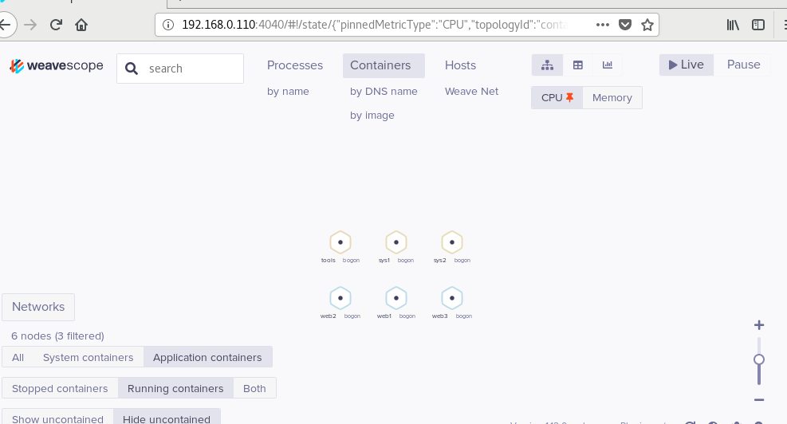
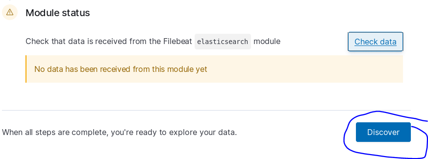
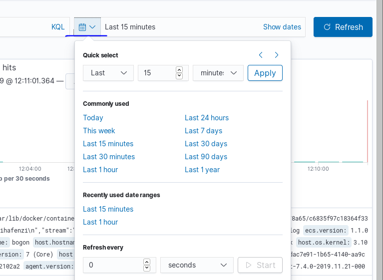
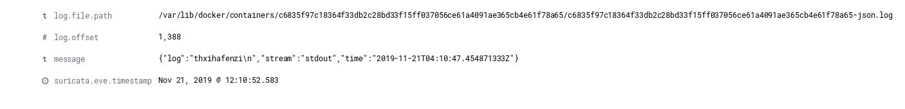

## 监控


先启动六个容器

```
docker run -d -p 80 --name web1 httpd
docker run -d -p 80 --name web2 httpd
docker run -d -p 80 --name web3 httpd
docker run -itd --name sys1 centos /bin/bash
docker run -itd --name sys2 centos /bin/bash
docker run -itd --name tools busybox /bin/sh

```


查看容器中开启的进程

docker container  top  容器名/容器id

```
docker  pull  sysdig/sysdig
docker  pull  google/cadvisor
docker  pull  sebp/elk
```


sysdig：

```
docker container run -itd --rm --name sysdig --privileged=true --volume=/var/run/docker.sock:/host/var/run/docker.sock --volume=/dev:/host/dev --volume=/proc:/host/proc:ro --volume=/boot:/host/boot:ro --volume=/lib/modules:/host/lib/modules:ro --volume=/usr:/host/usr:ro sysdig/sysdig
```


```
docker exec -it sysdig /bin/bash
```


进入监控

```
csysdig
```

如果进入不了就安装

```
yum -y install  kernel-devel
```


# scope：

### 生成一个全图形的界面

网站

```
curl -L git.io/scope -o /usr/local/bin/scope

#给一个执行权限
chmod a+x /usr/local/bin/scope

#执行脚本，自动拉取需要的镜像
scope launch
```


访问本机ip




可以对容器进行操作


## google/cadvisor：


## uifd/ui-for-docker：

docker pull uifd/ui-for-docker

docker run -itd --name docker-web -p 9000:9000 -v /var/run/docker.sock:/var/run/docker.sock uifd/ui-for-docker

netstat -anpt | grep 9000

# sebp/elk：

docker run -d -p 5601:5601 -p 5044:5044  -p 9200:9200 -itd -e ES_HEAP_SIZE="2g" -e LS_HEAP_SIZE="1g" --name elk sebp/elk

echo "vm.max_map_count=262144" >> /etc/sysctl.conf 
sysctl -p

  240  netstat -anpt | grep 9200
  241  netstat -anpt | grep 5601
  242  netstat -anpt | grep 5044

curl -L -O https://artifacts.elastic.co/downloads/beats/filebeat/filebeat-7.4.0-x86_64.rpm

sudo rpm -vi filebeat-7.4.0-x86_64.rpm

 vim /etc/filebeat/filebeat.yml

```
  
    enabled: true
    - /var/lib/docker/container/*/*.tar
  host: "192.168.43.79:5601"
 hosts: ["192.168.43.79:9200"]

```

sudo filebeat modules enable elasticsearch

sudo filebeat setup

sudo service filebeat start




docker run busybox sh -c 'while true; do echo "this is a log massage from container busybox by duan"; sleep 10; done;'




查看：




