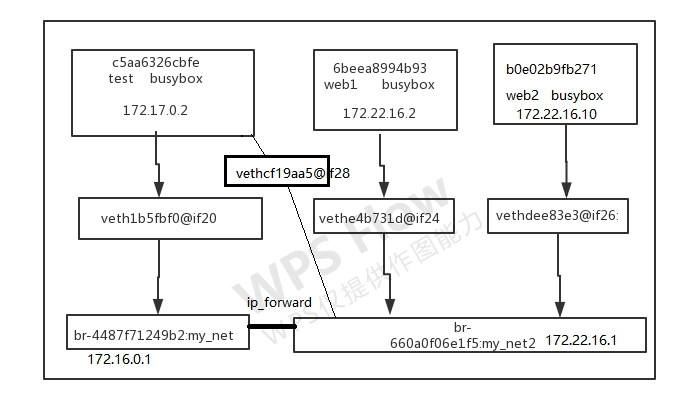
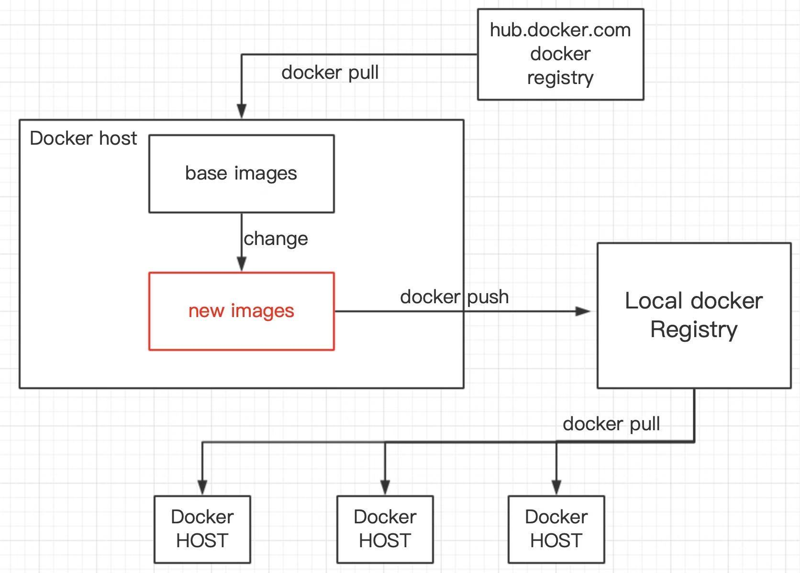
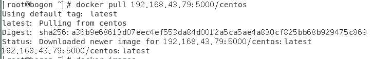
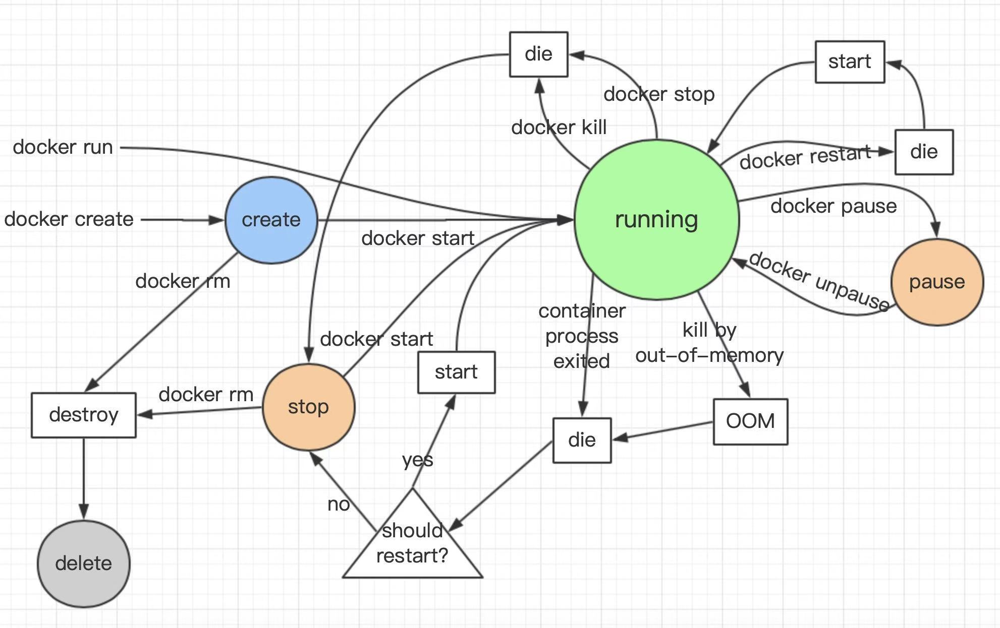
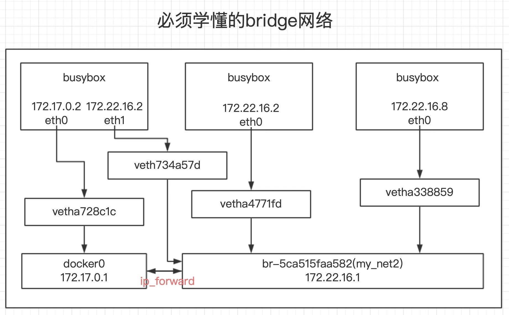

docker 第五天（仓库网络）

RUN　　

ＣＭＤ:执行一条命令

​    

 NETRYPOINT：指定可以让容器以应用程序或者服务的形式运行

有两种格式来运行

shell格式：和平时使用命令的方式一样




ENTRYPOINT    echo  “hello world”


```
FROM cemtos
ENV name dxh
ENTRYPOINT echo "hello $name"
```

docker  build -t test .

docker run -it test


Exec格式： 当执行指令的时候，不会执行/bin/sh

RUN [“yum”，“install”，“httpd”，“-y”]

CMD ["hello","world"]

ENTRYPOINT ["/bin/echo", "hello world"]

```
FROM cemtos
ENV name dxh
ENTRYPOINT ["/bin/sh","-c","/bin/echo","hello $name"]

```


## 小节：

于镜像相关的命令：

iamges

history

save 

load

build

pull

push 

search

commit  容器打包成镜像


# docker私有镜像（本地 仓库）

pull下来的是base镜像



## 本地仓库

docker pull registry:2

mkdir /opt/data/registry -p

docker run -itd -p 5000:5000 --restart always -v /opt/data/registry:/var/lib/registry --name registry registry:2

netstat -anpt |grep 5000

[root@bogon ~]# curl 192.168.43.79:5000/v2/_catalog
{"repositories":[]}

```
--insecure-registry 192.168.43.79:5000
```

重新加载守护进程

systemctl  daemon-reload

systemctl  restart  docker


把现有的镜像打包 

[root@bogon ~]# docker tag httpd:latest 192.168.43.79:5000/httpd
[root@bogon ~]# docker tag busybox:latest 192.168.43.79:5000/busybox
[root@bogon ~]# docker tag centos:latest 192.168.43.79:5000/centos

## 分机

vim /usr/lib/systemd/system/docker.service 

```
--insecure-registry 192.168.43.79:5000
```

systemctl  daemon-reload

systemctl  restart  docker

然后下载上传镜像会很快




docker容器的状态

docker   create     会创建成create状态    利用docker start启动会成为running

docker kill  stop   restart   pause会将其进行杀死，停止，重启和挂起操作  

kill  by  out-of-memory：内存


```
方格：不可见状态
圆形：可查看状态
三角形：判断状态
色彩：驻留在docker后台程序中
```




还有一个有意外的退出状态（非正常退出的容器）

```
container process exited(进程退出)，OOM(内存溢出)两个例子

​	cpe直接进入到dir状态，

​	oom先进OOM状态(判断一下内存)，然后在进入到die状态

​		然后都进入到dir状态以后，会有一个判断(是否需要重启)，

​			如果提前写好restart，直接进入到 start状态

如何填写退出直接进入到stopped状态然后执行docker rm

–restatrt=always表示因为其它因素关闭啦这个容器，就会自动重启这个容器
```


# docker网络：

none：没有任何的网络，只有loop back接口（环回接口）

host：跟物理机完全相同的网络。性能好（和虚拟机上的仅主机模式一样）

## bridge：用途最广

查看网络：

 brctl show


自己创建网卡

 docker network create --driver bridge my_net

docker network create --driver bridge --subnet 172.22.16.0/24 --gateway 172.22.16.1 my_net2


在不同网段中想要连通（在网络桥卡中添加对方的网络  用connect）

docker  network connect  my_net2 另一个网络桥卡id




