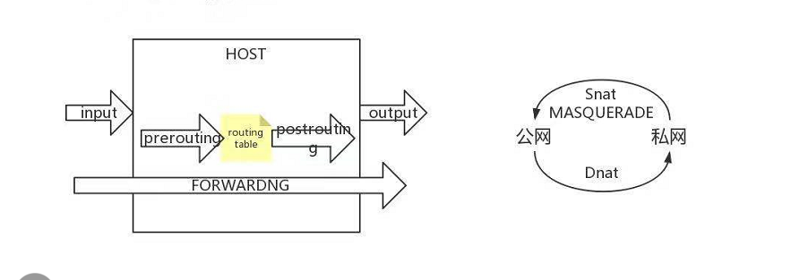
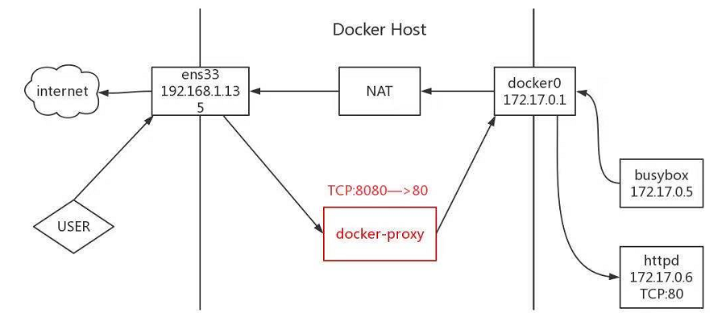

docker 容器卷共享  第六天

容器间的通讯方式：

ip：

dns  server： 只能在自定义网卡上运行

```
docker network create --driver bridge --subnet 172.86.86.0/24 --gateway 172.86.86.1 my_net
docker run -it --network my_net --name bbox1 busybox
docker run -itd --network my_net --name bbox2 busybox

```

joined容器：

```
 docker run -itd --name web1 httpd
  docker exec -it  web1 /bin/sh
  在这个容器里面看不到ip
 docker run -it --network container:web1 busybox 
 
```


## 容器如何访问外部世界？   nat转换



私网转换公网   为snat

公网转私网      为dnat

## 外部世界如何访问容器？   端口映射



外部到内部是：外部请求到主机主机将请求交给docker proxy进程，这个进程通过他其中的表中的端口映射交给桥接容器的网卡，网卡将请求发送到容器


iptables -t nat -s

## docker  的数据管理

storager driver:镜像层+容器层

data volume：容器层内的热数据

data volume:他是无法设置volume的容量（和宿主机公用的硬盘）

```
分为
一
bind mount :   Host-->container
现在主机上创建一个目录把目录挂载到容器内部

docker run -d -p 80:80 --name dd --volume /htdocs:/usr/local/apache2/htdocs/ httpd:latest
这个容器内部还能可以改动

docker run -d -p 8001:80 --name dd1 --volume /htdocs:/usr/local/apache2/htdocs/:ro httpd:latest
加上:ro 容器内部就不可以改动了 

二：
manager mount:  container-->Host

创建一个容器把里面的目录映射出来
docker  run -d -p 80:80 -v /usr/local/apache2/htdocs  httpd:latest

然后查看mount文件位置
docker  inspect  容器id

切换过去到文件查看即可

docker volume是不会删除的除非是工作人员用docker volume rm 命令删除


共享数据：（数据之间的一致）
volume  contariner：专门为其他容器提供volume的容器  起到数据同步和备份的效果

创建一个提供服务的容器
docker create  --name web1 -v /htdocs/:/usr/local/apache2/htdocs -v /usr/local/apache2/htdocs httpd:latest

创建其他容器
docker run -d -p 80 --name web2 --volumes-from web1 httpd:latest 
docker run -d -p 80 --name web3 --volumes-from web1 httpd:latest 
docker run -d -p 80 --name web4 --volumes-from web1 httpd:latest


data-packed volume contariner：
vim dockerfile 
FROM busybox
ADD htdocs/   /usr/local/apache2/htdocs
VOLUME /usr/local/apache2/htdocs


mkdir htdocs
echo htdocs > htdocs/index.html
docker build -t datapacked .
docker create --name vc_data datapacked:latest
docker run -d -p 80:80 --volumes-from vc_data httpd
curl 192.168.43.79
docker volume inspect ce97f4a401b8dd134082b041f53d1e1b608082ba13a76bc48242f239bfe8ac62 

cd /var/lib/docker/volumes/ce97f4a401b8dd134082b041f53d1e1b608082ba13a76bc48242f239bfe8ac62/_data
cat index.html 
```


**1.** ***\*storage\**** ***\*driver：镜像的分层和dockerfike容器层\*******\*COW\****

容器由最上面一个可写的容器层，以及若干只读的镜像层组成，容器的数据就存放在这些层中。这样的分层结构最大的特性是 Copy-on-Write：

​		1.新数据会直接存放在最上面的容器层。

2.修改现有数据会先从镜像层将数据复制到容器层，修改后的数据直接保存在容器层中，镜像层保持不变。

3.如果多个层中有命名相同的文件，用户只能看到最上面那层中的文件

分层结构使镜像和容器的创建、共享以及分发变得非常高效，而这些都要归功于 Docker storage driver。正是 storage driver 实现了多层数据的堆叠并为用户提供一个单一的合并之后的统一视图

 

**2.** ***\*Data\**** ***\*volume\*******\*：详细探讨，分为四种，最目录产生映射并且制作镜像等过程。\****

冷数据à镜像层	热数据à容器层但是一旦停止数据就会丢失àData volume中实现数据持久化

2.1bind mount (绑定挂载) 是将 host 上已存在的目录或文件mount 到容器。

：指定是文件或者目录，不能是块设备(U盘)

​		 ：volume中的数据可以被永久保存===持久化

​		 ：volume的容器大小没有限额

2.2docker manager volume容器可以读取volume中的数据，并且保存到本地实现持久化   ：直接指定mount point的位置

​	 ：容器的数据à主机（bind mount主机的数据à容器）

​	如何共享数据（本地如何共享数据给容器）：每个容器只能映射相同的volume即可

​		  docker cp  /root/htdocs/index.html 6043a3303b6a:/usr/local/apache2/htdocs

***\*容器与host共享数据\****

我们有两种类型的 data volume，它们均可实现在容器与 host 之间共享数据，但方式有所区别。

1.对于 bind mount 是非常明确的：直接将要共享的目录 mount 到容器。

​		2. docker managed volume 就要麻烦点。由于 volume 位于 host 中的目录，是在容器启动时才生成，所以需要将共享数据拷贝到 volume 中，如下

​		docker cp  /root/htdocs/index.html 6043a3303b6a:/usr/local/apache2/htdocs

 

***\*容器之间的共享数据\****

1.volume container共享数据：专门为其他容器提供volume的容器

volume container 是专门为其他容器提供 volume 的容器。它提供的卷可以是 bind mount，也可以是 docker managed volume

2.data-packed volume contarner：把需要的volume做到镜像里面

​		通过dockerfile把volume持久化到镜像中

​			非常适合 只使用 静态数据的场景	